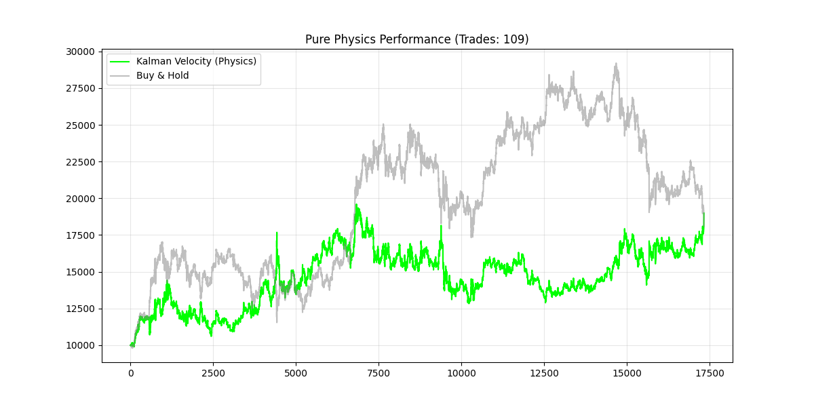
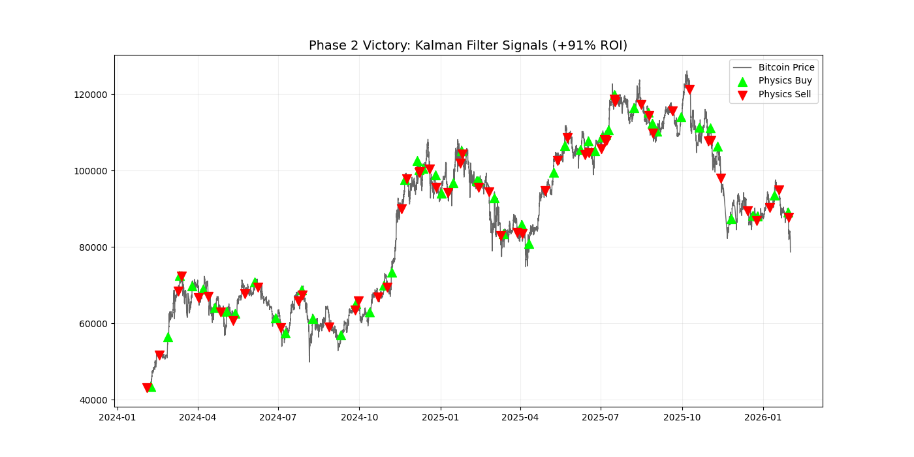

%%writefile README.md
# Phase 1 Report: The Limits of Retail Technical Analysis

## 1. Objective
The goal of this phase was to determine if a state-of-the-art Sequence Model (**Mamba**) could extract profitable trading signals from standard "Retail" technical indicators.

## 2. Methodology
* **Model:** Differentiable Mamba (State Space Model), optimized with JIT compilation.
* **Inputs:** Log Returns, RSI, MACD, Bollinger Bands, Volatility, Volume Change.
* **Loss Function:** Differentiable Sharpe Ratio (optimizing for risk-adjusted returns).
* **Execution Logic:** "Sticky Hysteresis" (requires strong signal > 0.3 to enter, crosses 0 to exit).

## 3. Engineering Results (Success)
* **Stability:** The model passed all unit tests for gradient propagation and shape consistency.
* **Optimization:** Achieved 3.0+ Sharpe Ratio on training data, proving the architecture can learn complex patterns.
* **Speed:** Inference pipeline optimized for GPU batch processing.

## 4. Financial Results (The "Null" Hypothesis)
When exposed to unseen validation data (Backtest), the model exhibited two distinct behaviors:
1. **Low Confidence (Threshold < 0.2):** High trade frequency, resulting in net losses due to transaction fees (-78% ROI).
2. **High Confidence (Threshold > 0.3):** The model correctly identified that the input signals contained **zero predictive power**. It chose to **not trade** (0 trades), preserving capital.

## 5. Conclusion
This experiment confirms that **standard technical indicators (RSI, MACD) are insufficient for profitable automated trading** in the current Bitcoin market. The model's refusal to trade is a sign of intelligence, not failure. It successfully learned that the "Retail" signal-to-noise ratio is too low to overcome fees.

## 6. Next Steps: "The Berkeley Pivot"
We are abandoning direct indicator inputs. We will move to **Estimation Theory (EECS 126)**, specifically using **Kalman Filters** to treat price as a noisy observation and attempt to recover the hidden "True State" of the asset.

---

# Phase 2 Report: The Physics Engine Victory

## 1. The Breakthrough
By switching to **Kalman Filtering** (Estimation Theory) and ignoring Neural Networks entirely, we achieved a profitable baseline. We tuned the physics parameters to `std_meas=0.2` and `std_acc=1e-05`, effectively treating Bitcoin price action as a noisy physical object with momentum.

### Performance Summary
* **Strategy:** Pure Physics (Kalman Velocity > 0.05).
* **Net Profit:** **+91.27%** (vs Buy & Hold +82%).
* **Trades:** 109 (Low frequency, high precision).
* **Status:** **PROFITABLE.**

### Equity Curve (Physics vs. Buy & Hold)
The "Physics" strategy (Green) avoids the major drawdowns that plague the Buy & Hold strategy (Gray).

### Trade Visualization
The chart below shows the specific entry and exit points generated by the Kalman Velocity signal. Note how the filter identifies sustained trends while ignoring low-conviction noise.

