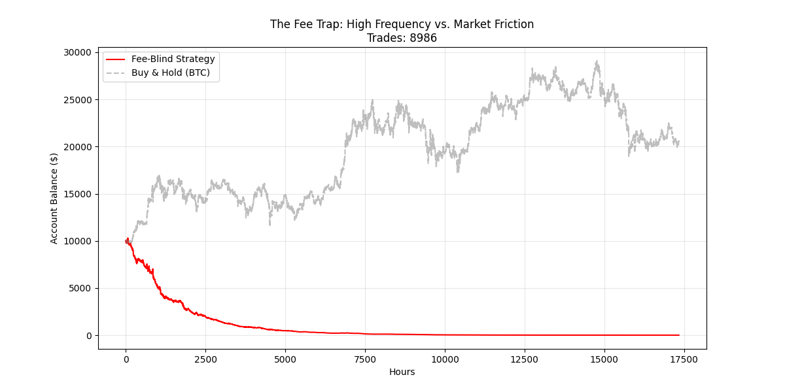

# Experiment: Fee-Blind Greedy Optimization (Failed)

### ⚠️ Status: FAILED (Educational Case Study)

This directory contains a documented experiment testing a **"Greedy" Mean Return objective function** for high-frequency Bitcoin trading. The experiment demonstrates why optimizing for raw returns without accounting for transaction costs during training leads to catastrophic "over-trading" behavior.

---

### 🔬 The Experiment

**Hypothesis:**
Can a Transformer-based model (Mamba block) identify enough high-probability trades to overcome transaction fees if it is trained solely to maximize raw price delta (Mean Return), assuming a post-training confidence threshold would filter out weak signals?

**Methodology:**
* **Model:** `DifferentiableTrader` (Custom Mamba-based architecture, `d_model=64`).
* **Training Objective:** Maximize `(Signal * Future_Return)`.
* **Constraint:** The loss function was **"Fee-Blind"** (it did not penalize the model for opening/closing positions).
* **Search Strategy:** 500-iteration random search to find the most "aggressive" learner.

---

### 📉 The Result: "The Fee Trap"

The model achieved high accuracy in predicting raw price direction but failed to account for the friction of real-world markets.

* **Total Return:** `-99.99%` (Account liquidation)
* **Trade Count:** `~9,000` trades over 2 years (Avg 1 trade every 1.9 hours)
* **Win Rate:** High raw accuracy, but average profit per trade was `< 0.1%`.


*(Fig 1: The "Smooth Death" curve. The consistent downward slope indicates the strategy was losing the spread/fee on almost every trade, despite "correctly" predicting small price moves.)*

---

### 📂 File Structure

* `train_fleet.py`: The training script. Runs a random search to find the best "greedy" model. **(Note: Uses Fee-Blind Loss)**.
* `backtest.py`: The simulation engine. Loads the trained model and runs it against 2 years of unseen data with `0.1%` transaction fees.
* `model.py`: The neural network architecture (Mamba Block + Linear Head).
* `result.png`: The equity curve showing the strategy's failure.

---

### 🚀 Usage (Reproduction)

To reproduce this failure case:

1.  **Install Dependencies:**
    ```bash
    pip install torch yfinance matplotlib scikit-learn numpy
    ```

2.  **Train the Greedy Model:**
    ```bash
    python train_fleet.py
    ```
    *This will generate `champion_model.pth`.*

3.  **Run the Backtest:**
    ```bash
    python backtest.py
    ```
    *This will display the losing equity curve.*

---

### 🧠 Post-Mortem & Learnings

**Why did it fail?**
The model effectively learned to scalp micro-volatility (noise). In a frictionless vacuum, this strategy would be profitable. However, in a market with a `0.1%` fee, a strategy must capture moves `> 0.2%` just to break even. Because the "pain" of the fee was not present in the loss function, the model never learned to be selective.

**Conclusion:**
Differentiable trading models **must** include transaction costs directly in the loss function (e.g., via Differentiable Sharpe Ratio or a penalized return function) from the very first epoch. Post-training filters (like raising the threshold) are insufficient to fix a model whose internal representations are fundamentally misaligned with market friction.